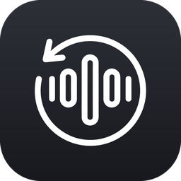
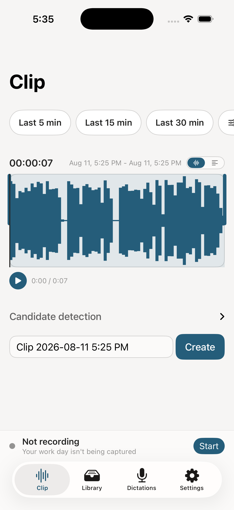
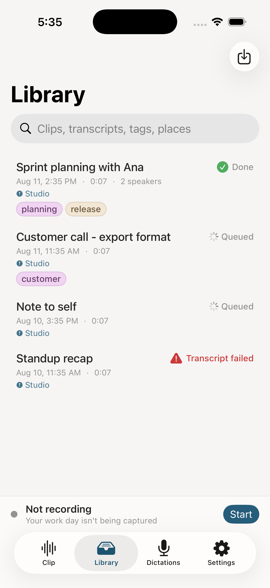
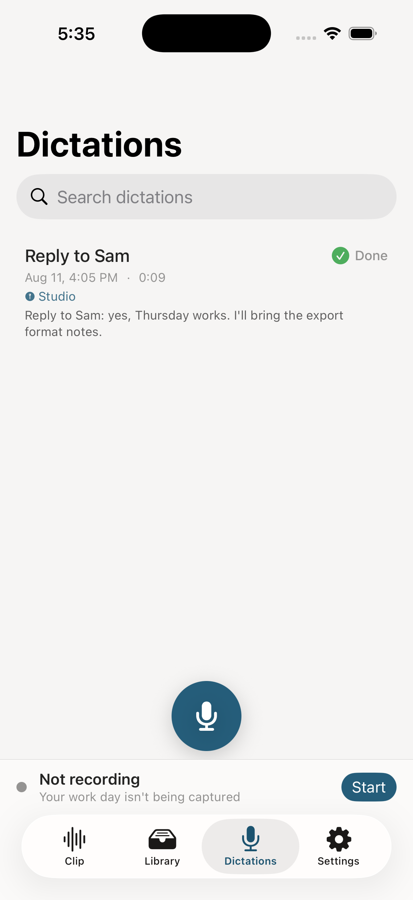

<p align="center">
  
</p>

<h1 align="center">Worklog</h1>

<p align="center">
  An always-on iPhone recorder for people whose best conversations happen away from the keyboard.<br/>
  Record all day · clip the moment that mattered · read it back, on-device or diarized in the cloud.
</p>

<p align="center">
  
  
  
  
  
</p>

<p align="center">
  
  
  
</p>

---

## Why

Someone walks up to your desk, you talk through a task for fifteen minutes, they leave - and the details live only in your memory. Worklog exists so that conversation is always already recorded. When it ends, you open the app, grab the last N minutes, trim to the part that mattered by eye and ear, and hit Create. A minute later you have a speaker-labelled transcript (plus translations and a summary, if you want them) ready to paste anywhere.

It was built to fix the two ways general-purpose recorders quietly betray you:

- **They follow whatever audio device just connected.** Worklog pins capture to one input you chose and holds it there - a headset connecting never steals the recording.
- **They stop silently.** If the pinned input genuinely disappears, Worklog shows a loud warning state and notifies you - it never switches mics silently and never stops silently, and it auto-resumes the moment the input returns.

Recording runs under the audio background mode, so it survives the screen locking and the app being backgrounded. Phone calls, Siri and alarms pause it and it resumes itself afterwards; a media-services reset rebuilds the engine; and if the process is killed mid-recording, the next launch repairs the open segment and picks up where it left off.

## Features

- **Always-on recording** - rolling 5-minute mono AAC segments (~28 MB/hour), organized by date, crash-safe by construction. Configurable retention (7/14/30 days, 1 year, never) purges only raw audio; clips and transcripts are never auto-deleted.
- **Clip screen** - load the last 5/15/30/N minutes or any historical date-time range (segments stitch into one seamless waveform), scrub, play, and drag start/end handles. Silence→speech transitions are detected, ranked, and offered as numbered, auditionable start-point suggestions - you always make the final call.
- **Live waveform** - a range that includes "now" keeps growing while you watch, fed by in-memory peaks straight from the capture tap. Amplitude auto-scales to the loudest peak in view.
- **On-device transcription** - speech recognised on the phone itself, with no account, no network and no cost. Runs alongside recording and, when you have not set up a cloud transcription key, becomes the transcript outright, always labelled with where it came from. Off by default.
- **Transcription pipeline** - clip → diarized transcript (ElevenLabs Scribe v2) → translations into each enabled language, in parallel → optional summary built from the raw transcript or a translation of your choice (Anthropic-compatible LLM; base URL, model, and effort are configurable, so a LiteLLM-style proxy works too). Every step's state is persisted; any step can be retried alone - even after success - without re-running (or re-paying for) the others.
- **Library** - every clip with live per-step progress, a seekable player, collapsible sections per artifact with copy / share / retry, swipe to rename or delete, and reverse-geocoded location that opens in Maps.
- **Read a clip by its words** - pick a clip range from a transcript instead of a waveform, drag across the text to select, and see the words at each edge of your selection while you trim.
- **Dictation** - press and hold the mic button to talk, release to save; slide up to keep going hands-free. Every dictation is kept, searchable, and retryable in its own tab.
- **Search** - fuzzy search across clip names, dates, transcripts, translations, and summaries, indexed incrementally in the background.
- **Your data stays on your device** - everything lives in the app's Documents folder as plain files plus one SQLite database, browsable in the Files app. No cloud, no sync, no telemetry, no accounts. Recording, clipping, playback, and search work fully offline with no keys; audio leaves your device only when you run a transcription, and only to the providers you configured.

## Transcription, two ways

Worklog can read a recording back to you without anything leaving the phone. On-device speech recognition runs alongside capture and produces timestamped words that drive the transcript view, the clip-range edges, and the live dictation line.

If you never configure a cloud key, that is your transcript. If you do, the accurate diarized version arrives too, and the on-device one stays beside it permanently - it is the only record of what the device itself heard, and it survives long after the raw audio ages out of retention.

There are two on-device engines behind one interface. On **iOS 26 and later** it is `SpeechAnalyzer`, which reports real per-word timings and can download more locales on demand. Below that it is `SFSpeechRecognizer` with `requiresOnDeviceRecognition`, which reports timings per segment - words are spread across the segment they came from, which is approximate but lands them within about a second. Neither ever opens the microphone: audio is fed to them from the capture tap, so a preview costs the recording nothing. See [docs/speech-previews.md](docs/speech-previews.md).

## Install

Build from source:

```sh
git clone https://github.com/rishabhrao/worklog-ios.git
cd worklog-ios
open Worklog.xcodeproj
```

Pick your team under **Signing & Capabilities**, choose your iPhone, and run. Requirements: **iOS 17+** on the device and **Xcode 16+** to build.

There are zero third-party dependencies - the project pulls nothing. SQLite is the system `libsqlite3` behind a small hand-rolled wrapper (no ORM), HTTP is `URLSession`, capture and export are `AVAudioEngine`/`AVAudioFile`/`AVAssetExportSession`, and the clip archive's zip is written and read by [`ZipArchive.swift`](Worklog/Sharing/ZipArchive.swift) on top of Apple's `Compression` framework, because iOS has no `Process` to shell out to `zip` with.

## First run

A short onboarding asks you to pick the input to pin and grant microphone access - that's all recording needs. API keys are only required for the transcription pipeline and are entered in Settings, stored in the Keychain:

- **ElevenLabs** - Scribe v2 diarized speech-to-text. An optional "disable logging" toggle opts requests out of ElevenLabs' logging (zero-retention mode; requires an enterprise key).
- **Anthropic** (or any Anthropic-compatible endpoint) - translations and summaries. Your key is sent to the base URL you configure, so only point it at a proxy you trust.

Recording never starts on its own; hit Start in the status bar above the tab bar.

## How your data is laid out

```
On My iPhone/Worklog/
├── recordings/                      # raw all-day audio - the only thing retention touches
│   └── 2026-08-11/
│       └── 0900_00.m4a              # rolling 5-minute segments
├── clips/
│   └── <clip-id>/                   # one folder per clip, every artifact together
│       ├── audio.m4a
│       ├── transcript.json          # diarized Scribe response, verbatim
│       ├── translation-<language>.md
│       └── summary.md
├── dictations/
│   └── <dictation-id>/
│       ├── audio.m4a
│       └── transcript.txt
└── worklog.db                       # SQLite: segments, clips, transcripts, translations,
                                     # summaries, waveform peak caches, app settings
```

Everything is a plain file, browsable in the Files app under **On My iPhone → Worklog**. API keys are never on disk in plain text.

## Three platforms, one engine

Worklog is also a [macOS menu-bar app](https://github.com/rishabhrao/worklog-mac) and an [Android app](https://github.com/rishabhrao/worklog-android). This build shares the macOS one's engine almost verbatim - the SQLite layer and schema, the transcription pipeline, clip export, peak computation, candidate detection, tags, places, search, and the archive format - so **a clip exported on any of the three imports into the other two**, transcripts, translations, summaries, tags and on-device words included. See [docs/clip-archive-format.md](docs/clip-archive-format.md).

The parts that genuinely differ are the parts the platforms disagree about:

| | macOS | iOS | Android |
| --- | --- | --- | --- |
| Capture substrate | `AVCaptureSession` | `AVAudioEngine` | `AudioRecord` |
| Holding the pinned mic | bind to the device by UID | `AVAudioSession.setPreferredInput` | bind to `AudioDeviceInfo` |
| On-device speech | `SpeechAnalyzer` | `SpeechAnalyzer` / `SFSpeechRecognizer` | platform `RecognitionService` |
| Feeding the recognizer | shared audio tap | shared audio tap | a pipe (a mic-mode recognizer would silence capture) |
| Dictating into other apps | global hotkey + synthetic paste | keyboard extension | input method |

The macOS build had to reach for `AVCaptureSession` precisely because its engine's input node chases the system default and fights any attempt to pin it. On iOS the audio session is the routing authority, so the engine is the right substrate - and it is the only one that reliably keeps running once the app leaves the foreground, which an all-day recorder cannot do without.

## A note on recording consent

Worklog records continuously by design. **You are responsible for complying with your local recording-consent laws** - one-party vs. all-party consent rules vary by country and state.

## License

[MIT](LICENSE)
